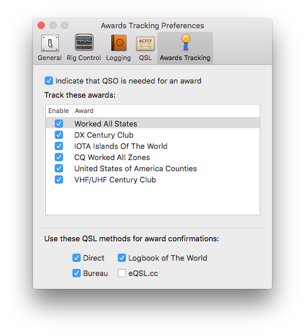
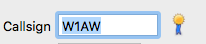
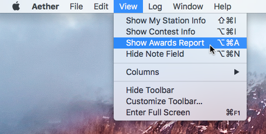
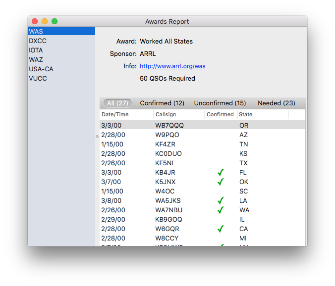

## Overview

Aether includes the ability to track operating awards you're trying to earn. It can quickly tell you if a newly entered callsign will help you with the requirements for an award. You can also see a detailed report of tracked awards, unconfirmed QSOs that count toward each award, QSOs made but still unconfirmed, etc.

## Set Up

To set up Awards Tracking:

1. Open Aether Preferences by selecting Preferences from the Aether menu (or pressing command-comma):

    

2. Select the Awards Tracking tab:

    

3. Check the box for "Indicate that QSO is needed for an award".

4. Check the enable checkbox for each award you'd like to track.

## Awards Tracking in Realtime

After you've set up awards tracking, Aether will show you whether a newly entered callsign would help you with one of your awards. When you enter a callsign in the callsign field and hit return, a small awards icon will appear if a QSO with that callsign will help you with progress toward an award you're tracking:

## Awards Report Window

You can open the Awards Report window by choosing Show Awards Report from the View menu, or by pressing option-command-A:

The Awards Report window allows you to see detailed information about your progress toward the awards you're tracking. You can select an award on the left to see progress information on the right:

At the top is information about the award, including the name, sponsor, a link to the award sponsor's website, and the total number of QSOs that are required to qualify for the award.

The bottom includes a list of QSOs that count toward your earning the award. You can click the buttons above the list to filter it to show All QSOs, only confirmed QSOs, only unconfirmed QSOs, or a list of contact that you still need to make before you qualify for the award. The number in parentheses to the right of each option tells you how many QSOs are in that category.

## Award Settings

Aether has a few settings related to awards tracking. For more information see the [Awards Tracking Preferences Page](/preferences/awardspreferences.md).
