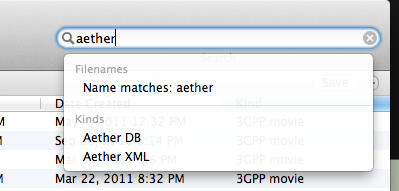
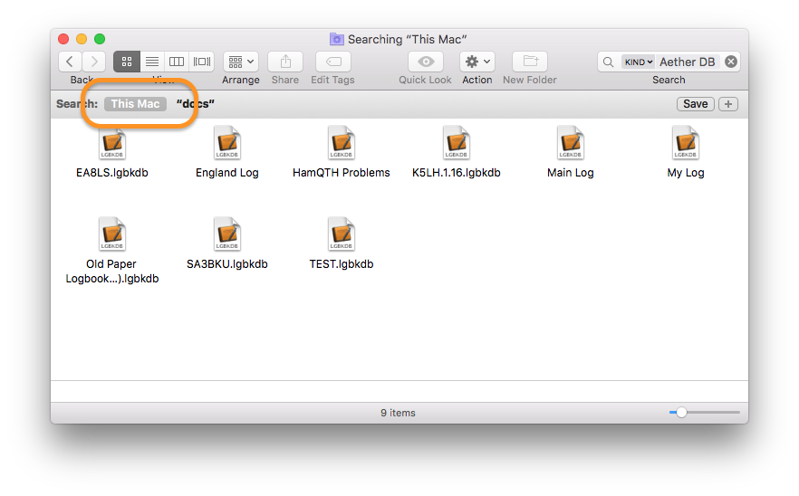

## Question:

I opened Aether and don't see my logbook? What happened to it and how can I get it back?

## Answer:

Most of the time, this does *not* indicate that your logbook is actually lost. Rather, it usually is simply that Aether failed to automatically reopen it for some reason. Assuming this is the case, see the options below to find it.

#### Open Recent

Often, if you choose File->Open Recent in the menubar, you will see your logbook in the recently opened documents list, and can reopen it that way.

#### Open Manually

If your logbook is not is not in the Open Recent list, you can open it manually. Choose File->Open (or press command-O), and navigate to the location in which you saved your logbook file.

#### Use Spotlight

If you are not sure where your logbook is saved, you can use Spotlight to help you find it. Follow the steps below:

1. Open a Finder window, then in the search field type "aether":

    

2. Notice that under Kinds, you see "Aether DB" and "Aether XML". Select "Aether DB" to show _all_ Aether logbook files on your machine. (Caveat: By default, Aether uses Aether DB format for logbooks, and has for some time. Unless you started using Aether several years ago, it's unlikely you'll have any in Aether XML format, but you can check just to be sure.)

3. Make sure you select "This Mac" as the search location.

    

4. Find your logbook in the search results that appear and double click on it to open it in Aether.

#### Further Help

If you're still unable to find your logbook file using the options above, you can contact [Aether support](https://www.aetherlog.com/contact.html) for further assistance.
