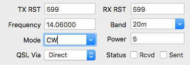
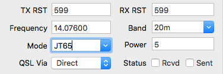

## Question:

Will you add support for mode X to Aether?

## Answer:

Often, this question stems from confusion about the way Aether's mode selector works. Aether uses a [combo box](https://en.wikipedia.org/wiki/Combo_box) for entering the mode in the QSO details section of the main window:

A combo box is a combination of a regular text field, along with a dropdown list. You are **not** limited to the modes in the dropdown box. Those are provided as simple shortcuts (and for autocomplete). Aether has always allowed you to type any mode you'd like in the mode field:

