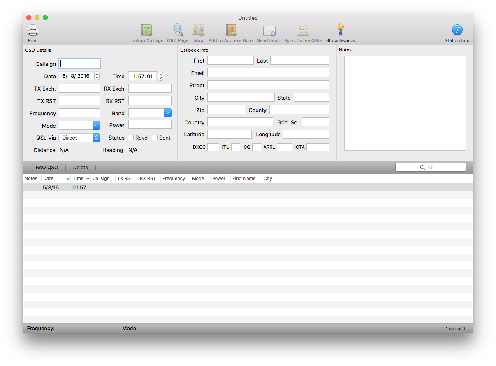
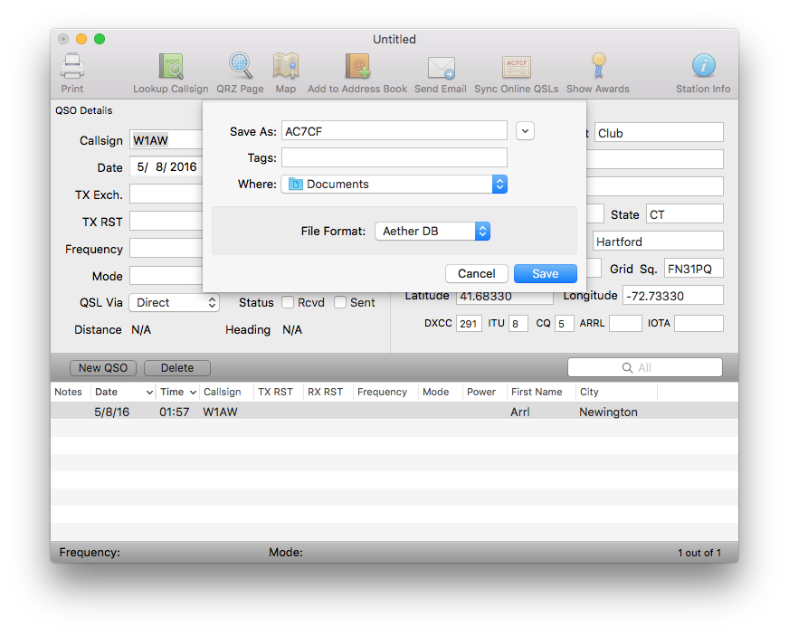

Aether provides an easy way to keep track of the contacts you make on the air. Aether includes features to make logging your contacts more efficient and fun. This page will walk you through the basics of using Aether.

If you have not yet installed Aether, see [this page](installing.md) for installation instructions.

## Opening Aether

With Aether installed, double click on its icon to start it up. If this is the first time you've run Aether, it will automatically create a new, empty logbook file for you. It should look like this:

If you don't see this, you can create a new logbook file yourself by choosing File->New in the menu bar (or press command-shift-N).

## Logging your first QSO

Now you're ready to log your first QSO! Make sure the cursor is in the callsign field in the top left corner of the window. Enter the callsign of the station you're working, and press the return key. If you entered a valid US callsign, you should see callbook information for that callsign automatically fill in the Callbook Info section on the right hand side of the window. Don't worry if you don't see this, as callbook lookup may require [more set up](callbooklookup.md).

If you'd like, continue filling in additional info for the QSO. A quick note: unless you're logging QSOs made in a contest, you can leave the TX Exch. and RX Exch. fields blank. Find more information about those fields [here](faq/txrxexch.md).

## Saving your logbook

Now that you've finished logging your first QSO, you should save your logbook file. To do so, select "Save" from the File menu (or press command-S). Aether will ask you for a name and location for your logbook file. You can name the file anything you'd like, and store it wherever makes sense. Storing it in your documents folder, and using your callsign for the name of the file is a good choice:

In almost all cases, you should leave "Aether DB" selected for the file format. When you've chosen a name and location, click Save.

Aether allows you to save as many logbook files as you like. They're just regular files. You can move them around, back them up, etc. You can even open more than one logbook file at the same time. The majority of Aether-using operators keep one main logbook file. However, there are many people who keep a separate logbook file for each QTH (location) from which they operate. If you work contests, it's a good idea to start a new logbook file for each contest.

As you use Aether, you should save your logbook often by pressing command-S.

## Quitting Aether

When you're done logging, you can quit Aether by choosing "Quit" from the File menu, or by pressing command-Q.

## Reopening your logbook

The next time you want to use Aether, launch it by double clicking its icon just as you did before. Normally, it should automatically reopen your logbook file. If it does not, you can reopen it yourself by choosing File->Open, navigating to the location where you saved your log, selecting it, and clicking Open. You can also double click on the logbook file in the Finder, or drag it onto Aether's icon in the dock.

## Next Steps

Now that you know the basics, you're ready to learn more about other features Aether has to offer. Here are some more resources:

- [Aether Preferences](preferences.md)
- [Callbook Lookup](callbooklookup.md)
- [Awards Tracking](awardstracking.md)
- [Rig Control](rigcontrol.md)
- [Importing and Exporting Your Logbook](importexport.md)
