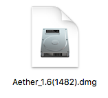
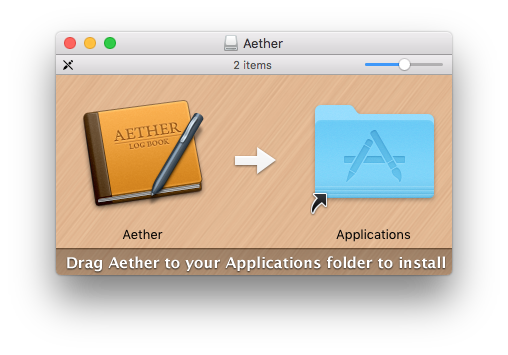
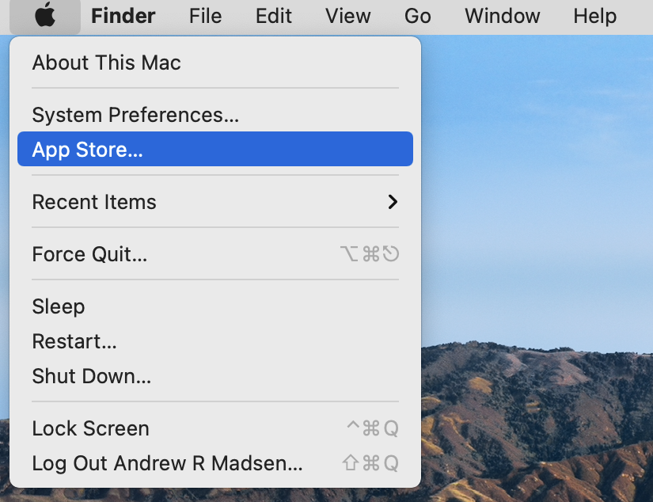
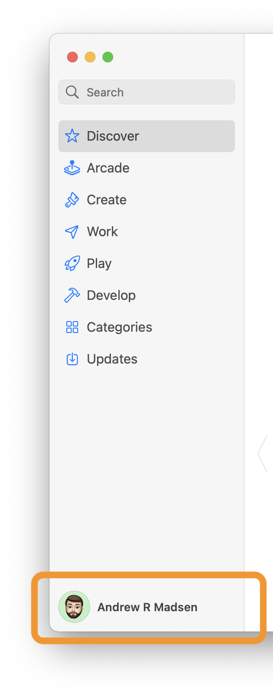
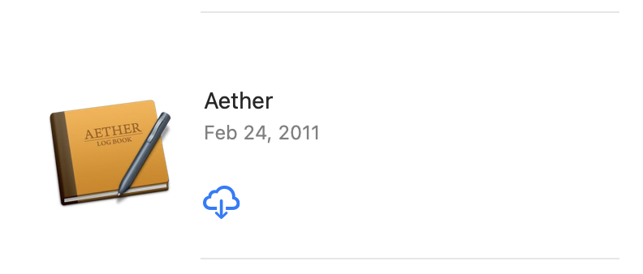

This page contains instructions for installing Aether. The steps for installing Aether depend on whether you purchased /downloaded Aether directly from the Aether website, or purchased it on the Mac App Store. Please find the appropriate section below:

## Installing From Aether Website

If you purchased or downloaded Aether from the Aether [website](http://www.aetherlog.com/), follow the steps below to install Aether.

1. Download Aether. You can always download the latest version [here](http://builds.openreelsoftware.com/apps/aether/release/download/latest_dmg).
2. When the download is finished, find the downloaded file, which will be named something like Aether_1.6(1482).dmg in your Downloads folder. The exact name will depend on the current version number for Aether, and is not important.

    

3. Double click Aether.dmg to mount it.
4. You should see a white disk icon called Aether on your Desktop. Double click on it to open it.

    

5. You'll see a window like this:

    

6. To install Aether, drag the Aether icon on the left to the Applications folder on the right. This will copy Aether into your Applications folder.
7. You should now eject the disk image. You can do this by dragging the white Aether disk icon (from step 4) to the Trash, which will change to an eject icon as you drag. Alternatively, you can select it and press command-E to eject it.
8. When you're ready to launch Aether, find it in your Applications folder, and double click it to launch.

## Installing from the Mac App Store

If you purchase Aether on the Mac App Store, you don't need to do anything extra to install it. It will be downloaded and installed to your Applications folder automatically upon purchasing it.

However, if you ever need to reinstall it or install it on a new computer, follow the steps below.

1. Open the Mac App Store by choosing "App Store..." from the Apple icon menu in the top let corner of your screen:

    

2. When the App Store opens, select your account in the lower left corner:

    

3. Find Aether in the list of your purchased apps, and click the Install button (cloud icon):

    

4. Aether will be downloaded and installed in your Applications folder.

5. When you're ready to launch Aether, find it in your Applications folder, and double click it to launch.

## Next Steps

Now that you've installed Aether, you're ready to start using it. See the [getting started guide](gettingstarted) guide to learn the basics of using Aether.

## Help

If you have any trouble installing Aether, you can [contact Aether support](http://www.aetherlog.com/contact.html).
