## Overview

After you request an LoTW certificate, you receive a .tq6 file from the ARRL. This file can only be imported into the same program that was used to request it. 
This page explains how to work with .p12 files.

## Common Problems Solved

Often, Aether users request a certificate with TQSL, then try to import the .tq6 file they receive into Aether, which doesn't work. The solution is to export a .p12 file from TQSL, then import _that_ into Aether.  Note that this process works the reverse way too. It is possible to export a .p12 file from Aether and import it into TQSL (or Aether on another computer), as well.

Along the same lines, you cannot use the .tq6 file you receive from the ARRL as a backup of your certificate, since you won't be able to import it into software on a new computer, or after resetting your LoTW settings. Exporting your certificates as .p12 files, then backing _those_ up is a good solution.

## Export .p12 From TQSL

Follow the steps below to export a .p12 file from TQSL, which you will then be able to import into Aether.

1. Open TQSL, and select the Callsign Certificates tab:
2. Select the certificate you wish to export on the left.
3. Click the "Save the Callsign Certificate for <your callsign>" button on the right:

    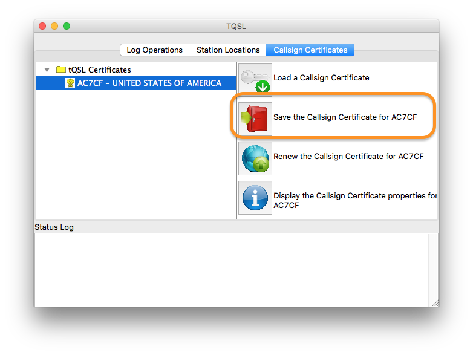

4. Choose a name and location to save the .p12 file:

    

5. You will be asked to create a new password for the .p12 file. Make sure you don't forget this, as you will need it later. You can also leave this blank, if you don't care to use a password.

    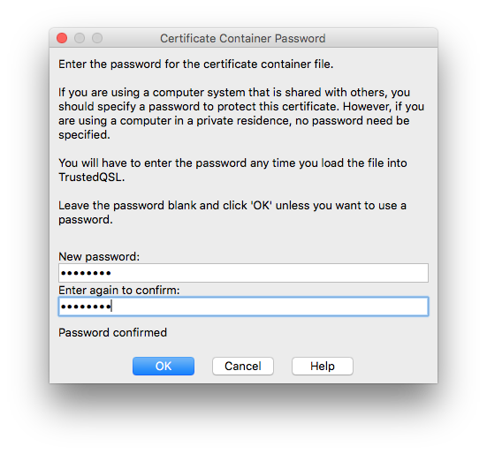

6. Enter the existing password for the certificate. This is the password you used when originally importing the .tq6 certificate file. It may be blank.

    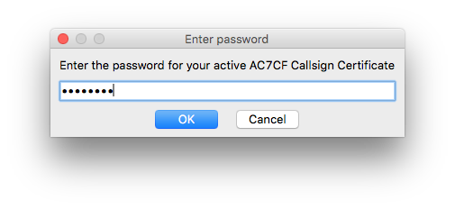

7. If everything worked, you'll see a message indicating that the save was successful:

    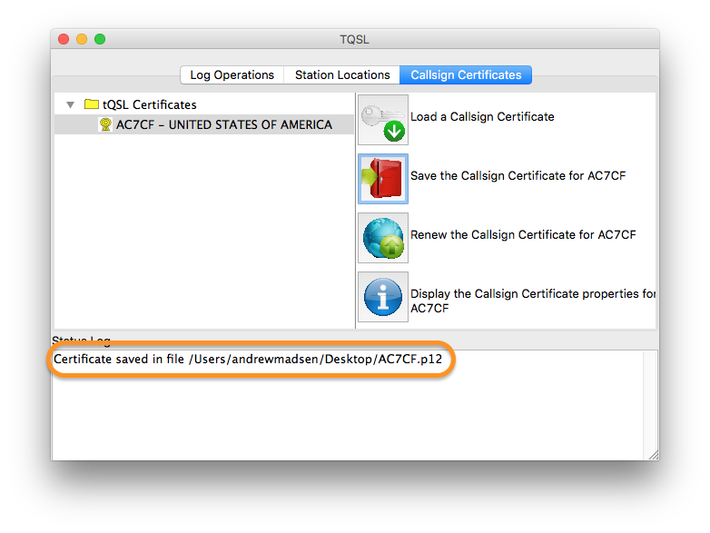

You're now ready to import the .p12 certificate file into Aether.

## Export .p12 From Aether

Follow the steps below to export a .p12 file from Aether, which you will then be able to import into TQSL or Aether on another computer.

1. Open Aether.
2. Open Aether preferences by choosing "Preferences..." from the Aether menu, or pressing command-comma.

    

3. Select the QSL tab of preferences.
4. Click the "Manage Certificates..." button:

    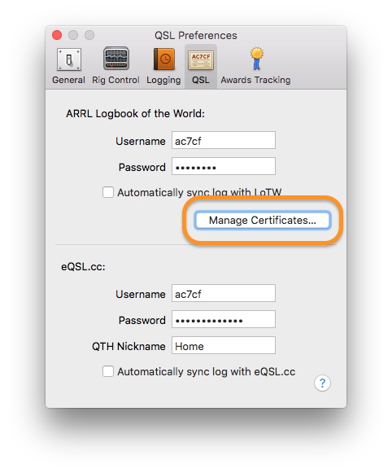

5. In the Manage LoTW Certificates window, select the certificate(s) you'd like to export:

	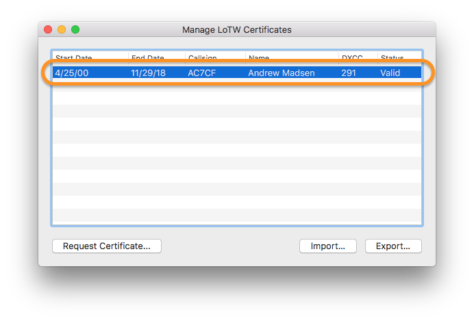

6. In the Manage LoTW Certificates window, click the Export button:

    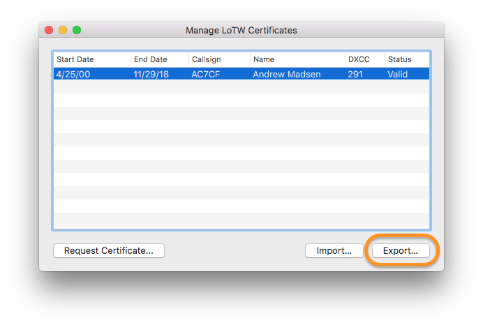

7. Choose a name and location to save the exported certificate, then click Save.

8. You'll be prompted to enter the password for the certificate. This is the password you used when originally importing the .tq6 certificate file. It may be blank.

    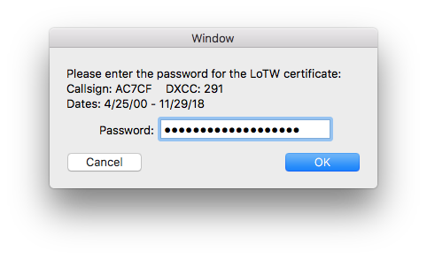

9. If everything worked, the .p12 file will be saved in the location you chose.

You're now ready to import the .p12 certificate file into another program.

## Import .p12 into Aether

Follow the steps below to import a .p12 file into Aether.

1. Open Aether.
2. Open Aether preferences by choosing "Preferences..." from the Aether menu, or pressing command-comma.

    

3. Select the QSL tab of preferences.
4. Click the "Manage Certificates..." button:

    

5. In the Manage LoTW Certificates window, click the Import button:

    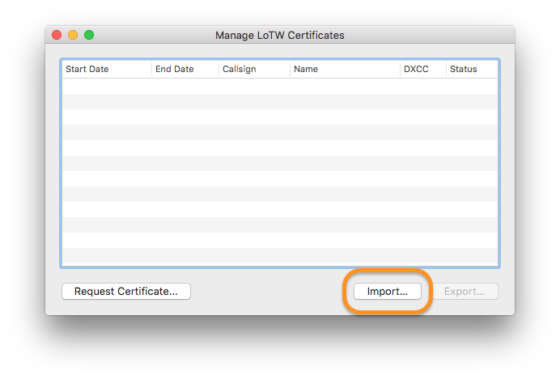

6. Select the .p12 file you wish to import, for example the file you exported from TQSL, then click Open:

    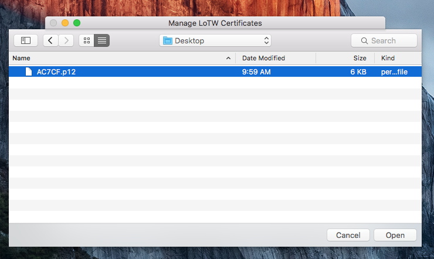

7. Enter the password you created when exporting the .p12 file. If you did not use a password, you can leave this blank and simply click OK:

    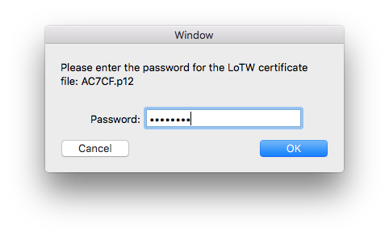

8. You should see a message indicating that the import was successful:

    

9. The certificate should now show up in Aether's Manage LoTW Certificates window:

   
