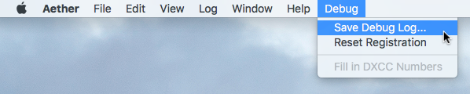

## Logbook of The World Troubleshooting Overview

Aether's full integration with the ARRL's Logbook of The World (LoTW) system is something that many Aether users appreciate. LoTW is a complex system and can be difficult to get set up and to use. In developing Aether's support for LoTW, I tried hard to make things simple. For example, Aether tries to minimize the number of unique passwords you need to maintain for LoTW, as compared to the standard TrustedQSL system. It also allows you to upload your logs to LoTW without the need for exporting them to ADIF first, and to easily and automatically update your log with received LoTW confirmations.

However, there are still places where trouble can be encountered. There are a few common problems that I hear about from Aether users, and these troubleshooting pages explain various problems and how to fix them. It's my hope that these will prevent frustration in the future.

To understand these common problems, it helps to have a good overall picture of the processes you and Aether go through to setup and use LoTW. This page describes these processes. Other pages describe common problems and how to fix them. This page goes into some detail about how _Aether_ uses LoTW. For more general information about the LoTW system, see the ARRL's [LoTW pages](http://www.arrl.org/logbook-of-the-world).

A quick side note about tqsl and tqslcert: While Aether makes use of the TrustedQSL library internally, the tqsl and tqslcert programs are _not_ required to be installed in order to use LoTW with Aether. Aether provides all of the important functions of tqsl and tqslcert by itself. However, Aether and tqsl and tqslcert can happily coexist. So, if you've already used tqsl/tqslcert, or need them for other reasons outside of Aether, keep them installed. If you've never used them before, Aether includes everything you need to get started and to use LoTW. With that out of the way, let's dive in.

## Requesting a Certificate

LoTW uses certificates to ensure the security and validity of log data you upload into the system. One of the first steps in setting up LoTW is to request a certificate so you can begin uploading QSOs. Aether includes the ability to request a certificate without the need for another application. In simple terms, Aether (or tqslcert) and the LoTW system perform the following steps when requesting a certificate:

1. Aether requests information for the certificate from you, most importantly your callsign, DXCC entity number, and start and end dates for QSOs to be uploaded with the certificate.

2. Aether generates a key pair for your certificate, consisting of a public key and a private key. The private key is kept secret and is stored in a special folder on your hard drive.

3. Aether uploads the certificate request, including the public key.

4. Sometime, often a day or two later, the LoTW system issues your certificate and sends it to you in the form of a .tq6 file.

5. You import this file into Aether, which matches the certificate up with the private key stored in step 2. Assuming this match is successful, the certificate is saved to your hard drive and can now be used to sign and upload QSOs to LoTW.

## Synchronizing with LoTW

Once you've requested and successfully installed one or more certificates, you're ready to begin uploading logs to LoTW. When you choose the option to synchronize QSOs with LoTW in Aether, the following steps are performed:

1. Aether determines which QSOs are to be uploaded. Only those QSOs whose LoTW Sent status is _unchecked_ are uploaded, to avoid unnecessarily re-uploading previously uploaded QSOs.

2. For each QSO to be uploaded, Aether attempts to find a certificate which can be be used to sign the QSO. The following criteria must be satisfied for Aether to be able to use a certificate to sign a given QSO:

    1. The QSO's date must fall within the certificate's start and end dates, selected when requesting the certificate.

    2. The station callsign and DXCC number for the current log (and thus the current QSO) must match the certificate's callsign and DXCC number.

    3. The certificate must not be expired. Certificates expire 3 years from the date they were requested.

3. Aether goes through each QSO and signs it using the certificate found for that QSO in step 2.

4. Aether uploads the signed QSOs to the LoTW server, and receives an acknowledgment that the server received the QSOs and added them to its processing queue.

5. Aether checks off the LoTW sent checkbox for each QSO successfully uploaded in step 4.

6. After the upload has finished (or failed if there was an error), Aether downloads confirmations from the server. This is the step where Aether finds out which previously uploaded QSOs you've _received_ confirmation for. Note that QSOs uploaded during this sync cycle will not be confirmed immediately, due to the LoTW's server's relatively slow processing of new QSOs.

7. For each confirmation downloaded in step 6, Aether attempts to find a matching QSO in the log. If a match is found, the LoTW Received checkbox is checked off. For a QSO to match a confirmation, the following criteria must be met:

    1. The QSOs date/time and the confirmation's date/time must be within 15 minutes of each other. This allows for some wiggle room when the two operators didn't log the exact same time for the QSO.

    2. The callsign of the contacted station must match.

	3. The band must match, but the precise frequency isn't considered.

If Aether encounters an error in performing any of the above steps, it reports the error to the user.

Having explained these processes, we can talk about common problems encountered when using Aether with LoTW. These are discussed on the following pages:

- [Certificate Troubleshooting](certificatetroubleshooting.md)
- [Missing Logs on the LoTW Website](lotwuploadtroubleshooting.md)

## Debug Log

If you're having trouble with Logbook of The World, and need to [contact Aether support](https://www.aetherlog.com/contact.html) for help, it can be very useful to have a debug log. This log often will contain additional information I can use to help track down the problem. To generate a debug log, please do the following:

1. Quit Aether.
2. Start Aether up from your dock while holding down the shift key. (If Aether is not in your dock, put it there temporarily by dragging it there from Finder.) This will put Aether in debug mode.
3. You'll know that it worked if you see a Debug menu to the right of the Help menu.
4. Attempt to synchronize with LoTW, hopefully provoking the error you're seeing.
5. Dismiss the error alert (if any).
6. Choose Save Debug Log from the Debug menu:

    

7. Choose a name and location for the debug log. Your desktop is a good choice.
8. Attach the log you saved to an email to [me](mailto:support@aetherlog.com).

Please note that this currently is only possible in the non-app store version of Aether. If you've having trouble and are running the app store version, please [contact Aether support](https://www.aetherlog.com/contact.html).

## More Help

If you're unable to solve the problem with LoTW using the information on this page, please [contact Aether support](https://www.aetherlog.com/contact.html).
