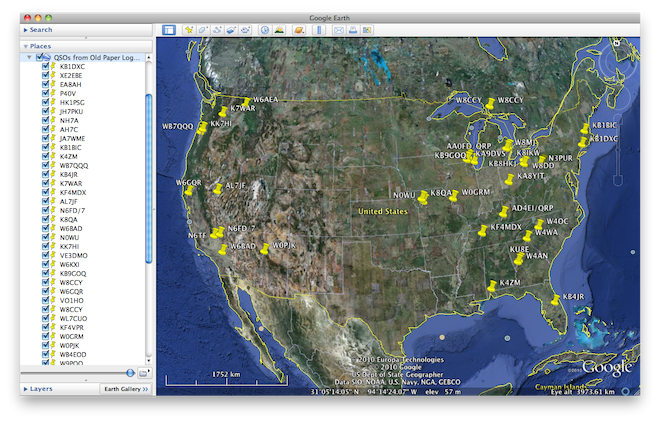

## Overview

Aether can export KML (Keyhole Markup Language) files for import into mapping software like Google Earth. This will allow you to see a map of all the QSOs in your log at once in Google Earth. This page includes instructions for exporting a KML file from Aether and importing it into Google Earth.

## Export KML From Aether

1. Open the logbook file you'd like to export.
2. Optionally choose the QSOs you'd like to export by selecting them in the QSO table.
3. From the File menu, choose "Export…".
4. Choose "KML (Google Earth)" as the File Type
5. Choose to either export only the selected QSOs, or all QSOs in the log.
6. Select a name and location to save the KML file.

## Import KML Into Google Earth

1. If necessary, download and install [Google Earth](https://www.google.com/earth/).
2. Open Google Earth.
3. Choose Open from the File menu, then navigate to the location in which you saved the KML file above, and click Open.
4. Alternately, you can simply drag the KML file onto Google Earth's icon in the Dock.
5. Your QSOs will be listed by callsign under "Temporary Places" in the list of places on the left.
6. Double click on a callsign to zoom into the location for that QSO.

#### Important Note

As Google Earth is third-party software, I am unable to provide any technical support for it.
