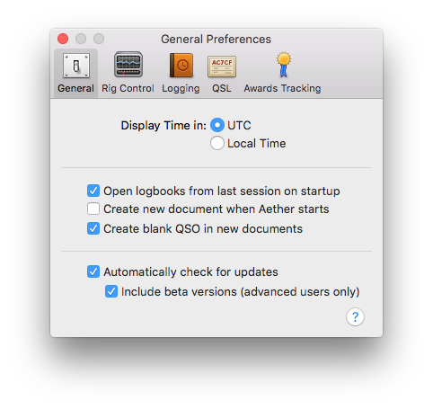

## Overview

The General tab of preferences consists of three sections from top to bottom:

- Time Display Settings
- New Document Settings
- Update Checking Settings (non-app store only)

## Time Display Settings

This setting controls whether QSO times are displayed using your local time zone, or UTC. This does *not* affect how QSO times are stored in your logbook file itself, merely how they are displayed and expected to be input in the interface. The default, and recommended setting is UTC.

## New Document Settings

This section includes options related to Aether's behavior when launching and creating new documents.

#### Open logbooks from last session on startup

When the "Open logbooks from last session on startup" option is enabled, Aether will try to automatically reopen the same logbook(s) you had open the last time it was quit. This is enabled by default.

#### Create new document when Aether starts

When "Create new document when Aether starts" is enabled, instead of reopening old documents, Aether will create a new logbook file every time it is launched. This is disabled by default and most users will not want to enable it.

#### Create blank QSO in new documents

The "Create blank QSO in new documents" option controls whether or not Aether creates a new blank QSO automatically when a brand new logbook is created using e.g. File->New. This is enabled by default, but as most users don't create new logbooks frequently, it is not hugely important.

## Update Checking Settings

This section includes options related to Aether's auto update feature. Note that when Aether is purchased from the Mac App Store, it does not include this feature because the app store itself takes care of automatically updating apps.

#### Automatically check for updates

When "Automatically check for updates" is enabled, Aether will check for updates when it is opened (but not more often than once per day). If an update is found, it will prompt you to download and install it, which can be done with just one click. Users are explicitly asked about this option on the second launch of Aether. It is _**strongly**_ recommended that you leave this option enabled.

#### Include beta versions

When "Include beta versions" is enabled, Aether will also check for pre-release beta test versions of Aether when it does its update check. This option is **disabled** by default, and is only recommended for use by advanced users, or when directed to by Aether support. By enabling this option, you Aether will update itself to the very latest beta releases, which may contain bugs, but also contain new features being worked on. For more information see [this page](../faq/beta.md).
