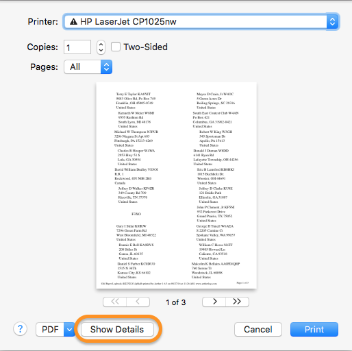
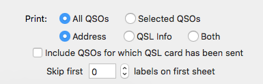
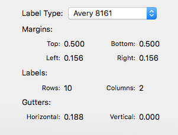

## Overview

Aether includes the ability to print labels for QSL cards. It can print both QSO information labels as well as mailing labels. This page includes information about how to use this feature.

## How To

To print address and/or QSL card labels for the QSOs in your log, do the following:

1. Open the Aether logbook containing the QSOs for which you want to print QSL labels.
2. From the File menu, select "Print Address/QSL Labels..."
3. Select the printer you'd like to use.
4. In the print sheet that appears, make sure details are shown. If they are not, click the "Show Details" button at the bottom of the sheet:

    

5. With details shown, select Aether in the section dropdown:

    

6. Choose appropriate options for the labels you'd like to print:

    

    - Whether or not to print labels for all QSOs in your logbook, or only those that are selected in the QSO table.
    - Whether to print mailing labels, QSO info labels, or both.
    - Whether to print labels for QSOs whose "Direct QSL" status has been marked sent, or to skip them (the default).
    - To skip a certain number of labels on the first sheet. This allows you to continue using a sheet that has previously had some but not all of its labels printed on.

7. Choose the type of label sheet you're using from the Label Type dropdown:

    

8. When all the settings are correct, click Print.

## Custom Label Template Definitions (Experts Only)

If you'd like to print labels on a label sheet type that Aether does not provide built in support for, it is possible to create your own label sheet definition file. This is an advanced topic intended for use by those with some technical experience. I don't provide support for it, but have documented it here in case it's useful to some people.

The file should be a JSON file containing an array of one or more dictionaries where each dictionary contains parameters for a single label sheet type. It must be named with the file extension `labeldefs`. An example is below:

```
[
  {
    "bottomMargin" : 0.5,
    "labelTypeName" : "Avery 8160",
    "labelSheetWidth" : 8.5,
    "numberOfColumns" : 3,
    "leftMargin" : 0.188,
    "rightMargin" : 0.188,
    "horizontalGutter" : 0.125,
    "labelSheetHeight" : 11,
    "topMargin" : 0.5,
    "numberOfRows" : 10,
    "verticalGutter" : 0
  }
]
```

Install the file by dragging it on to Aether's dock icon, selecting it with File->Open, or manually copying it to `~/Library/Containers/com.openreelsoftware.aether/Data/Library/Application Support/Aether`. You may need to restart Aether after installing the file for Aether to start using it.
