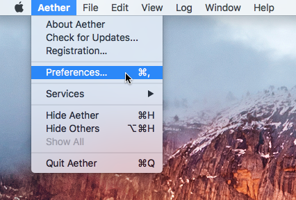
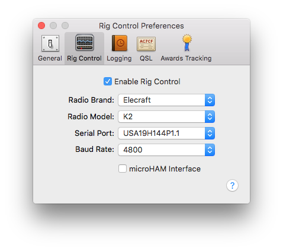
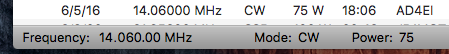
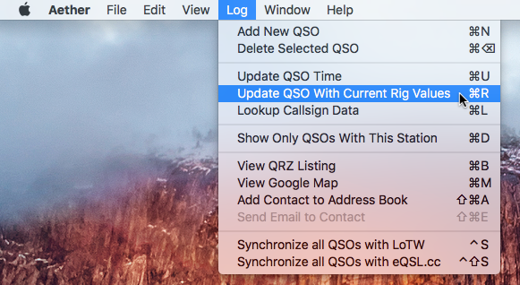

## Overview

Aether's rig control feature allows you to connect your radio to your Mac and have Aether automatically read -- and log -- your current frequency, mode, and power. This capability is made possible by the fact that nearly all HF amateur radios sold within the last 30 years include a port for rig control, sometimes called a CAT (Computer Aided Transceiver) port. With rig control set up and enabled, instead of manually entering the frequency, mode, and power level for each QSO you log, Aether can automatically pull this data from your rig, making logging easier. For a list of supported rigs see [this page](supportedrigs.md).

This page contains information about the feature, and how to enable it.

## Set Up

#### Interface
In order to use the rig control feature in Aether, you need to do some set up. First, you'll need an appropriate hardware interface (often called a "CAT interface") to connect your Mac to your radio. The exact interface will depend on the rig you have. See [this page](riginterfaces.md) for detailed information about choosing the correct interface hardware for your radio.

#### Drivers

Most CAT interfaces require the installation of a driver on your Mac in order to operate. [This page](rigdrivers.md) has detailed information about available drivers, and how to choose the correct one for your interface.

#### Rig Setup

Most radios include various settings related to rig control. Covering the specifics of every single rig model here would not be practical, so please refer to your rig's user manual for more information. There are a few common settings that can be configured:

- Baud Rate - Some rigs allow the use of multiple baud rates. Make sure you know which baud rate your rig is set to use. You will need to match this when setting up Aether.
- CAT enabled - Some rigs allow rig control to be enabled and disabled in the menus. Make sure CAT is enabled for your rig if it has such a setting. Icom rigs in particular have a "CI-V Transceive" setting that must be set to "On" to work with Aether.

#### Set Up in Aether

When you've acquired an interface, installed drivers for it, and configured your radio, you're ready to set up rig control in Aether. Follow the instructions below to do so:

1. Make sure your radio is properly connected, and turned on.
2. Open Aether Preferences by choosing "Preferences..." from the Aether menu:

    

3. Select the "Rig Control" tab in the Preferences window:

    

4. Check the "Enable Rig Control" checkbox.
5. Select the brand of radio you have.
6. Select your radio's model number
7. Select the serial port corresponding to your CAT interface. Often there will only be one choice.
8. Select the baud rate used for rig control. This _must_ match the baud rate set in your rig's menus. Having an incorrect/mismatched baud rate selected is one of the most common problems causing rig control not to work.
9. If rig control is working, you should see the current frequency, mode, and power appear in the lower left corner of your logbook window. (Note that many Yaesu radios do not support reading power over the CAT interface, and for those rigs power will be missing.)

    

#### Logging with Rig Control

Once you've set up rig control, Aether will automatically fill in frequency, mode, and power (power not available on some Yaesu rigs) when you log new QSOs. Note that Aether considers a QSO logged when you enter a callsign then press return. Therefore, it is only when you press return in (or tab away from) the callsign field that the current rig data is filled into the QSO.

You can also manually update the selected QSO with the current rig data at any time by selecting "Update QSO with Current Rig Values" from the Log menu (or press command-R).

## Help

Please see the [rig control troubleshooting](troubleshooting.md) page for information about troubleshooting rig control in Aether.

If you have any trouble with rig control in Aether, and have not been able to fix the problem using the information here, you can [contact Aether support](http://www.aetherlog.com/contact.html).

## Caveat

Currently, Aether only supports reading data from a connect rig. So, while the feature is called "rig control", actual _control_ of a rig (ie. _changing_ parameters on the rig from Aether) is not currently possible.
